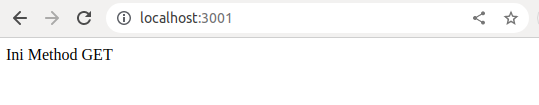
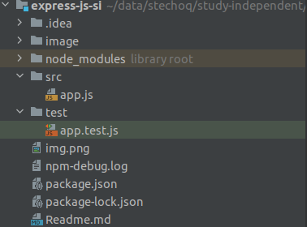
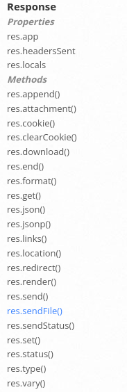

## Framework Express JS + Unit Test

### Buat Project dan Application
1. Buat Folder 

```bash
mkdir express-js
```
2. Inisialisasi Project

```bash
npm init -y
```

3. Open project dengan IDE (VS Code)

```bash 
code .
```

4. Open file package.json dan ubah seperti ini

```json
{
  "name": "express-js-si",
  "version": "1.0.0",
  "description": "Belajar Express JS",
  "main": "src/app.js",
  "scripts": {
    "start": "node ./src/app.js",
    "dev": "nodemon ./src/app.js",
    "test": "echo \"Error: no test specified\" && exit 1"
  },
  "author": "triyas",
  "license": "ISC",
  "dependencies": {
    "express": "^4.18.2"
  }
}
```
5. Tambahkan folder src dan file app.js di ./src/app.js

```bash
mkdir src
```

./src/app.js
```js
const express = require("express")

const app = express()

app.listen(3001, ()=>{
    console.log("Server started on port 3001")
})
```

6. Coba jalankan

```bash
$ npm start

> express-js-si@1.0.0 start
> node ./src/app.js

Server started on port 3001

```

coba buka browser dengan alamat http://localhost:3001

### Basic Routing
Routing merupakan teknik yang digunakan untuk meneruskan request dari URL path ke callback yang kita tuju.

| Method                              | HTTP                 |
|-------------------------------------|----------------------|
| ```js app.connect(path,callback)``` | HTTP Method CONNECT  |
| ```js app.get(path,callback)```     | HTTP Method GET      |
| ```js app.post(path,callback)```    | HTTP Method POST     |
| ```js app.put(path,callback)```     | HTTP Method PUT      |
| ```js app.delete(path,callback)```  | HTTP Method DELETE   |
| ```js app.options(path,callback)``` | HTTP Method OPTION s |
| ```js app.trace(path,callback)```   | HTTP Method TRACE    |
| ```js app.head(path,callback)```    | HTTP Method HEAD     |
| ```js app.patch(path,callback)```   | HTTP Method PATCH    |
| ```js app.all(path,callback)```     | ALL HTTP Method      |

Contohnya:
```js
app.get('/', (req, res)=>{
    res.send('Hello world')
})
```

app.js

```js
const express = require("express")

const app = express()

app.get('/', (req, res)=>{
    console.log('Ini Method GET')
    res.send('Ini Method GET')
})

app.listen(3001, ()=>{
    console.log("Server started on port 3001")
})
```

Coba buka link http://localhost:3001 dengan Browser.



Reference :
https://expressjs.com/en/4x/api.html#app

### Unit test
Keunggulan menggunakan unit test:
- Dapat melakukan automation testing
- Memudahkan kita untuk melakukan testing jika terdapat perubahan di aplikasi kita

Implementasi Unit Test:
1. Install Jest https://jestjs.io/docs/getting-started
   - Install depedensi ```bash npm install --save-dev jest```
   - Tambahkan script ini:
   
      ```json 
      {
          "scripts": {
            "test": "jest"
          }
      }
      ```
   - Menjalankan jest: ```bash npm test ./test/app.test.js```

2. Supertest adalah salah satu library yang bisa digunakan untuk membantu melakukan pengetasan web ExpressJS.
Npm supertest https://www.npmjs.com/package/supertest.

3. Install depedensi supertest
    ```bash 
    npm install supertest --save-dev
    ```
4. Tambahkan folder test dan file ./test/app.test.js

   

   app.test.js

   ```js
   const express = require("express")
   const request = require('supertest')
   
   const app = express()
   
   app.get('/', (req, res)=>{
      res.send('Hello World!')
   })
   
   test('Hello World', async ()=>{
      const response = await request(app).get("/")
      expect(response.text).toBe('Hello World!')
   })
   ```
5. Menjalankan jest: ```bash npm test ./test/app.test.js```

### Request

Contoh informasi object HTTP Request
- Query
- Param
- Header
- Body
- dll

Dokumentasi detail:


#### Query Test

```js 
const express = require("express")
const request = require('supertest')

describe('Request', function () {
   test('Query',async ()=>{
      const app = express();
      app.get('/', (req, res)=>{
         res.send(`Hello ${req.query.name}`)
      })

      const response = await request(app)
              .get('/')
              .query({name:'World'})

      expect(response.text).toBe('Hello World')
   })
});
```

#### URL Information
```js
const express = require("express")
const request = require('supertest')

describe('Request', function () {
   test('URL Information', async ()=>{
      const app = express()

      app.get('/hello/world', (req, res)=>{
         res.json({
            path: req.path,
            originalUrl: req.originalUrl,
            hostname: req.hostname,
            protocol: req.protocol
         })
      })

      const response = await request(app)
              .get('/hello/world')
              .query({name:'World'})

      expect(response.body).toEqual({
         path: '/hello/world',
         originalUrl: '/hello/world?name=World',
         hostname: '127.0.0.1',
         protocol: 'http'
      })
   })
});
```

#### Header

```js
const app = require('express')
const request = require('supertest')

test('Header', async ()=>{
   const app = express()
   app.get('/', (req, res)=>{
      const type = req.get('Accept')
      res.send(`Hello ${type}`)
   })

   const response = await request(app).get('/').set('Accept', 'text/plain')

   expect(response.text).toBe('Hello text/plain')
})
```
Reference:
https://expressjs.com/en/4x/api.html#req

### Response



#### Send
```js
const app = require('express')
const request = require('supertest')

describe('Response', function () {
   test('Send',async ()=>{
      const app = express();
      app.get('/', (req, res)=>{
         res.send(`Send Response`)
      })

      const response = await request(app).get('/')

      expect(response.text).toBe('Send Response')
   })
});
```

#### Response Status

```js
const app = require('express')
const request = require('supertest')

describe('Response', function () {
   test('Response Status', async ()=>{
      const app = express()
      app.get('/', (req, res)=>{
         if (req.query.name){
            res.status(200).send(`Hello ${req.query.name}`)
         } else {
            res.status(400).end()
         }
      })

      let response = await request(app).get('/').query({name:'test'})

      expect(response.status).toBe(200)
      expect(response.text).toBe('Hello test')

      response = await request(app).get('/')
      expect(response.status).toBe(400)
   })
});
```


#### Response Header

```js
const app = require('express')
const request = require('supertest')

describe('Response', function () {
   test('Response Header', async ()=>{
      const app = express()
      app.get('/', (req, res)=>{
         res.set({
            'X-Powered-By':'Study Independent',
            'X-Author':'Triyas'
         }).end()
      })

      const response = await request(app).get('/')

      expect(response.get('X-Powered-By')).toBe('Study Independent')
      expect(response.get('X-Author')).toBe('Triyas')
   })
});
```


#### Response Body

```js
const app = require('express')
const request = require('supertest')

describe('Response', function () {
   test('Response Body', async ()=>{
      const app = express()
      app.get('/', (req, res)=>{
         res.set('Content-Type', 'text/html')
         res.send('<html><head><title>Hello Html</title></head></html>')
      })

      const response = await request(app).get('/')
      expect(response.get('Content-Type')).toContain('text/html')
      expect(response.text).toBe('<html><head><title>Hello Html</title></head></html>')
   })
});
```

Reference:
https://expressjs.com/en/4x/api.html#res

